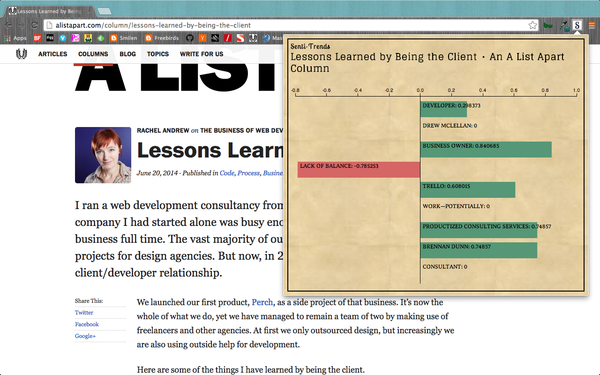

#Senti-Trend Chrome Extension

##Overview

[Senti-Trend](https://chrome.google.com/webstore/detail/senti-trend/mpiibijblggpgpoddialioodnlbgongg "Senti-Trend") is a pop-up Chrome Extension that displays the Sentiment Analysis data for the main topics within the webpage being viewed. It was designed as an analysis tool for articles specifically, but will reveal data for any URL you visit containing "entities" as defined by the Alchemy API. Senti-Trend was developed over a 5-day sprint as my final project for General Assembly's WDI program, and was inspired by [Trend 365](https://github.com/ab75173/trend365 "Trend 365"), an earlier group project.

##Technologies Used
* Google Chrome Extension API's
* JavaScript & jQuery
* D3.js
* Alchemy API for Entity Sentiment Analysis
* Ruby on Rails

##User Stories
* A user can click on extension icon to reveal a pop-up
* A user can see data on the pop-up according to current tab they are viewing
* A user can navigate between different tabs or windows and pop-up content will change dynamically
* A user can see title of current page on pop-up
* A user can see Entity Sentiment Analysis for up to 15 top entities of URL content
* A user can see this Entity Sentiment Analysis displayed in D3 bar graph showing negative or positive sentiment score for each entity
* A user cannot see Alchemy API key within extension source (need for an AJAX call to a [Rails back-end](http://github.com/maryhipp/sentitrend_server "Rails back-end"))

##Screenshot Examples

##Production

[Download it from the Chrome Web Store](https://chrome.google.com/webstore/detail/senti-trend/mpiibijblggpgpoddialioodnlbgongg "Download it from the Chrome Web Store") to see Senti-Trend in action!

